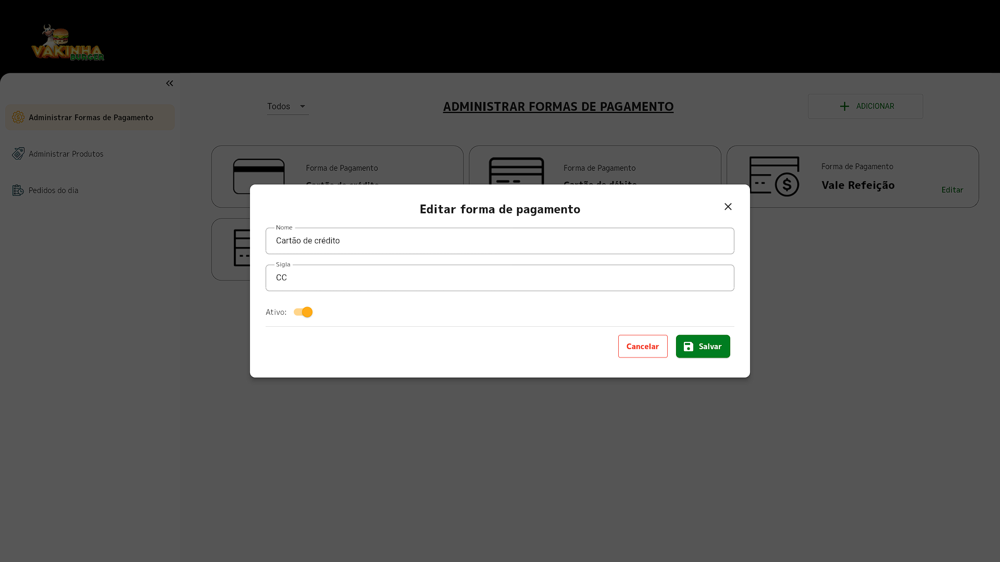

# DW10 Backoffice Delivery Web

Projeto criado durante a 10ª Dart Week da [Academia do Flutter](http://academiadoflutter.com.br/).
Onde foi desenvolvido o backoffice para WEB do aplicativo de [delivery](https://github.com/ezequiasmelo/dw9-delivery) usando o [Mobx](https://pub.dev/packages/mobx), [Flutter Modular](https://pub.dev/packages/flutter_modular) e outros packages. No backend foi utilizado o pacote [Json Rest Server](https://pub.dev/packages/json_rest_server).

## Funcionalidades

- [x] Autenticação
- [x] Administrar Formas de pagamento
- [x] Administrar produtos
- [x] Pedidos do dia

## Screens

    
    
    
    
    
    
    

